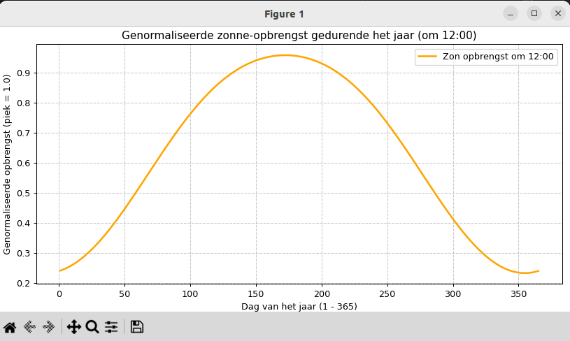

# Model voor zon-PV opbrengst in Nederland
## Door: Edwin van den Oetelaar
## Status: Concept (v0.1)

De zonne-energieopbrengst (PV-curve) in Nederland volgt een uitgesproken seizoensgebonden patroon. Dit model beschrijft de theoretische opbrengst onder ideale (onbewolkte) omstandigheden, genormaliseerd ten opzichte van de piek op 1 juni.
Kernpunten van de zonnecurve:

* Seizoensvariatie: De opbrengst in de winter is aanzienlijk lager door zowel de kortere dagduur als de lagere zonnestand. Waar de genormaliseerde piek op 1 juni op 1.0 ligt, daalt deze op 21 december naar circa 0.18 (een factor 5,5 lager).
* Dagelijkse cyclus: De opbrengst volgt een klokvormige curve. Door de geografische ligging van Nederland en de zomertijd valt de dagelijkse piek gemiddeld rond 13:40 uur.
* Jaargemiddelde: In Nederland levert een standaard installatie jaarlijks gemiddeld tussen de 0,85 en 0,95 kWh per Wp, afhankelijk van de locatie (kust vs. binnenland) en de hellingshoek.

Mathematische Benadering (Curvefit)
De theoretische dagelijkse opbrengst $P(d, t)$ kan worden gemodelleerd als een functie van de dag van het jaar ($d$) en het tijdstip ($t$). De basis hiervoor is de zonnehoogte ($\alpha$), waarbij de opbrengst evenredig is met de sinus van deze hoek:
$$P_{output} \approx 1.15 \cdot \max(0, \sin(\alpha))$$ 
Hierbij geldt voor de zonnehoogte $\alpha$:

* Hoogte: Afhankelijk van de breedtegraad (52° NB) en de declinatie van de aarde ($\delta$).
* Breedte: De curve is in de zomer breed (lange dagen, vroege zonsopkomst) en in de winter smal (korte dagen).

Variabelen in de praktijk:

* Zomerdag (bijv. 21 juni): Een brede, hoge curve met een maximale zonnehoogte van circa 61°.
* Winterdag (bijv. 21 december): Een smalle, lage curve met een maximale zonnehoogte van slechts circa 14.5°.
* Bewolking: Dit model beschrijft de Clear Sky potentie. Real-time bewolking zorgt voor grillige fluctuaties; op een zwaarbewolkte dag resteren vaak slechts 10-20% van de theoretische waarden door diffuus licht.

De totale jaarlijkse zonuren in Nederland liggen gemiddeld rond de 1500-1600 uur, met uitschieters aan de kust (Zeeland/Waddeneilanden).

