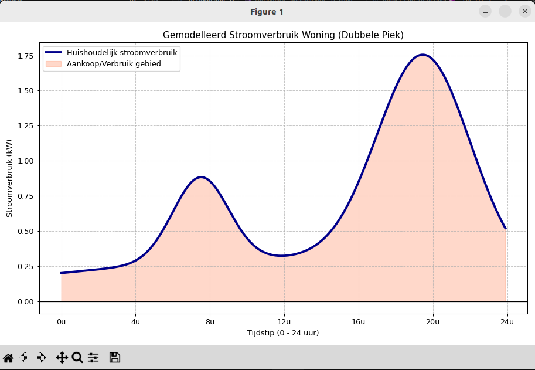

Model voor energieverbruik (Elektra)

Ik heb de zwarte lijn uit je schets (de zogenaamde 'duck curve'/'dubbele piek') benaderd met een wiskundig model op basis van overlappende functies (zogenaamde Gauss-curves voor de pieken).

Een vaste basislast met lichte stijging overdag.
Een ochtendpiek (rond 07:30) van ongeveer 1,5 uur breed.
Een bredere, hoge avondpiek (rond 19:30) van ongeveer 2,5 uur breed.
Het levert een vloeiende curve op die heel mooi de grafiek uit je schets nabootst.

## Kleine thuisaccu	

| capaciteit | vermogen |  toepassing |
| --- | --- | --- |
| 4 – 5 kWh	| 2,0 – 3,0 kW | Geschikt voor 1-2 persoons huishoudens met een verbruik rond 2.500 kWh/jaar.